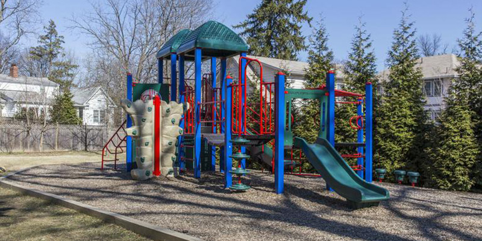

\pagestyle{fancy}
\fontsize{10}{10}
\fontfamily{pbk}


Battery Park is a community in Bethesda bordered roughly by Old Georgetown Road to the northeast, Wilson Lane on the Southwest, Custer Lane to the West, and Huntington Parkway to the Northwest, forming a rough triangle. Around 200 homes make up the community. 

Battery Park is lucky to be one of the few neighborhoods to enjoy its own Clubhouse, which residents have the privilege of using. The Clubhouse grounds include two tennis courts, a children's playground, and an open field area. The Clubhouse itself...


Above: Battery Park's playground was renovated in 2012.
\pagebreak
\fancyhf{}
\rhead{Battery Park Directory 2015}
\lhead{By Last Name}
\rfoot{Page \thepage}

#Alphabetical List of Battery Park Residents by Last Name
\begin{multicols}{2}

```{r  dev="pdf", results = "asis", echo = FALSE, cache=FALSE, message=FALSE, warning = FALSE, out.extra=''}
source("executable.R")
for(i in 1:length(directoryEntriesAll)){
        cat(directoryEntriesAll[i])
        cat(" \\par ")
}
```
\end{multicols}


\pagebreak

\lhead{Street Name Index}

#Street Name Index

\begin{multicols}{3}
```{r dev="pdf", results = "asis", echo = FALSE, cache=FALSE, message=FALSE, warning = FALSE, out.extra=''}

for(i in 1:length(streetEntries)){
        cat(streetEntries[i])
        cat(" \\par ")
}
```
\end{multicols}
